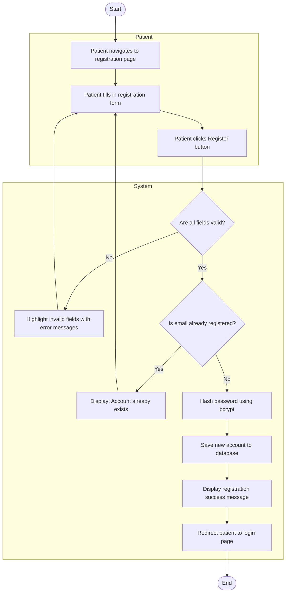
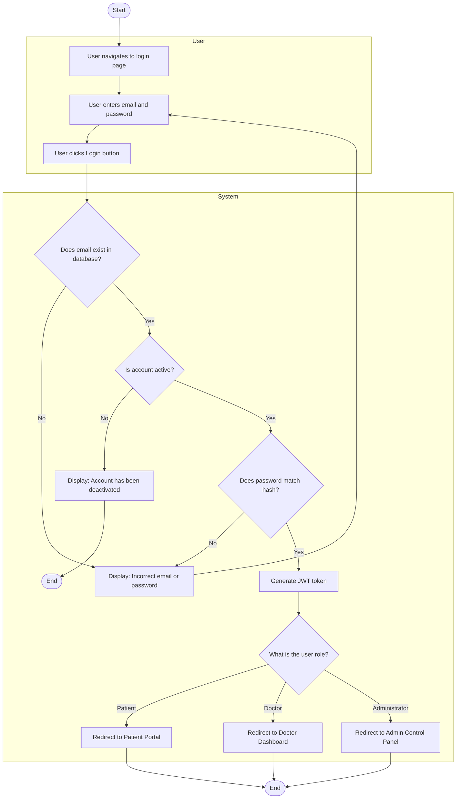
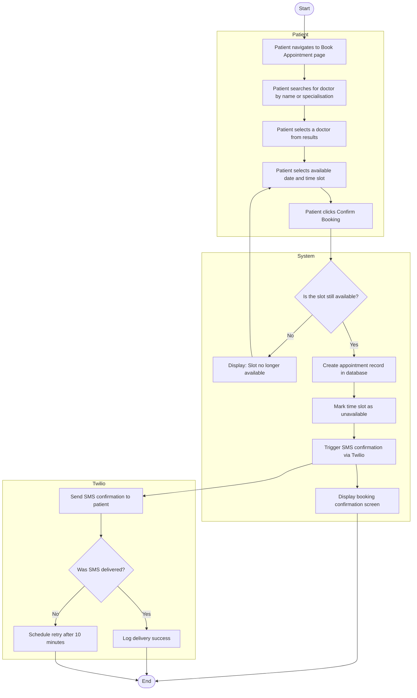
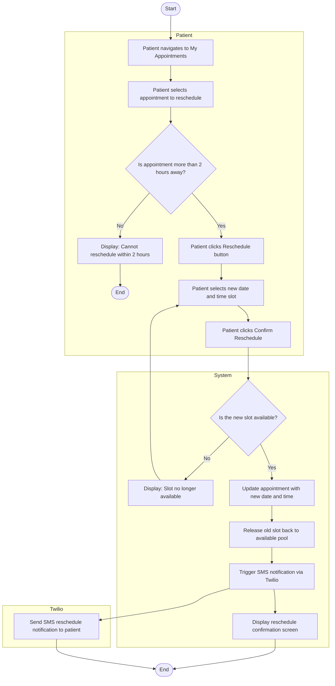
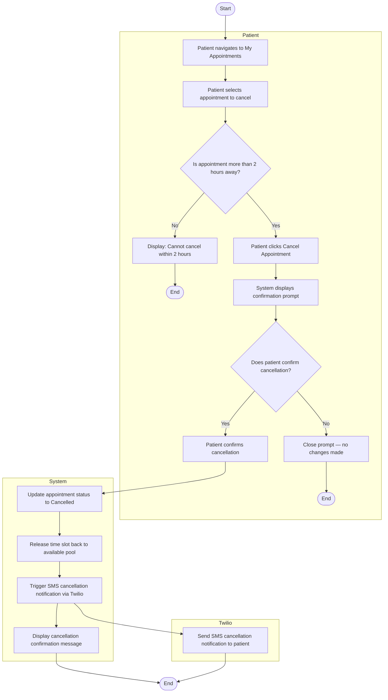
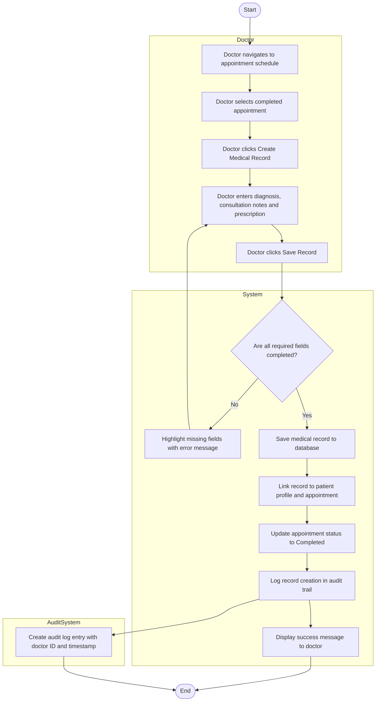
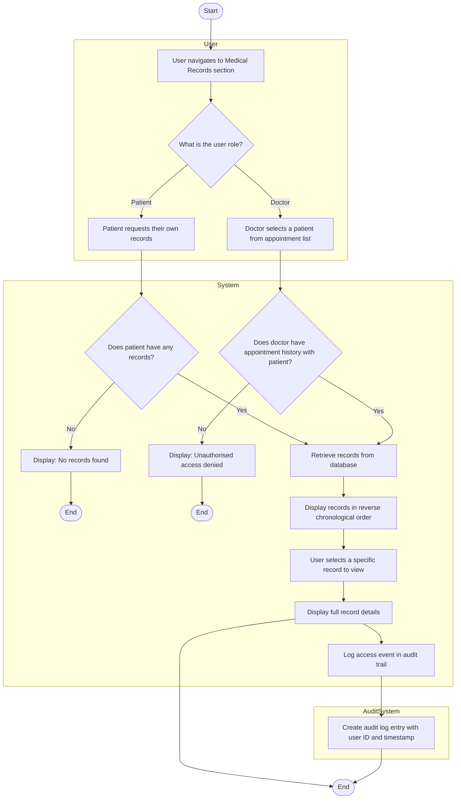
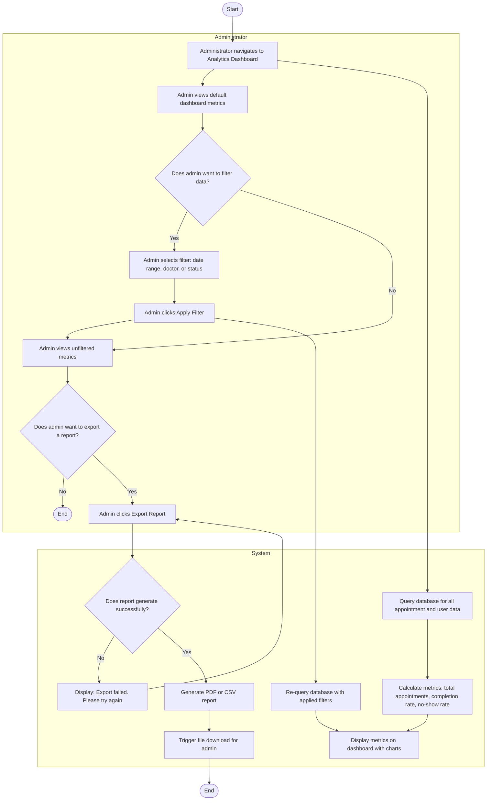

# ACTIVITY-DIAGRAMS.md — Activity Workflow Modeling for PulsePoint

**Assignment:** 8 — Object State Modeling and Activity Workflow Modeling

---

## 1. Introduction

This document presents activity diagrams for 8 critical workflows in the PulsePoint system. Each diagram models the step-by-step flow of a process, including start and end nodes, actions, decision points, parallel actions, and swimlanes showing which actor is responsible for each step. All diagrams are aligned with the functional requirements from Assignment 4 and the user stories from Assignment 6.

---

## 2. Activity Diagram 1 — User Registration

### Explanation
This diagram models the complete patient registration workflow. The Patient swimlane covers form input and submission, while the System swimlane handles all validation, security, and database operations. The decision nodes address two key alternative flows — invalid input and duplicate email — ensuring the system handles errors gracefully before saving any data.

**Functional Requirement Mapping:** Functional Requirement 01 — User Registration.
**User Story Mapping:** US001 — As a patient, I want to register an account.
**Stakeholder Concern Addressed:** Patient's need for a simple and fast registration process.

---

## 3. Activity Diagram 2 — User Login and Role-Based Redirect

### Explanation
This diagram models the login workflow with role-based redirection. Three decision nodes handle the key validation steps — email existence, account status, and password verification. The final decision node routes the authenticated user to their role-specific dashboard. This ensures that every user sees only the interface relevant to their role.

**Functional Requirement Mapping:** Functional Requirement 02 — User Authentication and Role-Based Access.
**User Story Mapping:** US002 — As a patient, I want to log in to the system.
**Stakeholder Concern Addressed:** Security requirement that each role only accesses permitted features.

---

## 4. Activity Diagram 3 — Book Appointment

### Explanation
This diagram models the full appointment booking workflow across three swimlanes — Patient, System, and Twilio. The parallel paths after the booking is confirmed show that the confirmation screen is displayed to the patient at the same time as the SMS is being sent — these are concurrent actions. The Twilio swimlane shows the SMS delivery and retry logic running independently of the main booking flow.

**Functional Requirement Mapping:** Functional Requirement 03 — Appointment Booking, Functional Requirement 08 — SMS Reminders.
**User Story Mapping:** US004 — As a patient, I want to book an appointment. US007 — As a patient, I want to receive an SMS reminder.
**Stakeholder Concern Addressed:** Patient's need for convenient self-service booking and automated confirmation.

---

## 5. Activity Diagram 4 — Reschedule Appointment

### Explanation
This diagram models the appointment rescheduling workflow. The guard condition "more than 2 hours away" is implemented as a decision node in the Patient swimlane, immediately blocking the reschedule attempt if the condition is not met. The System swimlane handles the slot availability check, database update, and old slot release as sequential steps before triggering the SMS notification.

**Functional Requirement Mapping:** Functional Requirement 04 — Appointment Rescheduling and Cancellation.
**User Story Mapping:** US005 — As a patient, I want to reschedule an existing appointment.
**Stakeholder Concern Addressed:** Patient's need for flexibility in managing their appointments.

---

## 6. Activity Diagram 5 — Cancel Appointment

### Explanation
This diagram models the cancellation workflow with two guard conditions — the 2-hour restriction and the patient confirmation prompt. The confirmation prompt prevents accidental cancellations, which was identified as an important usability requirement. The System swimlane ensures the slot is immediately released back to the available pool so other patients can book it.

**Functional Requirement Mapping:** Functional Requirement 04 — Appointment Rescheduling and Cancellation.
**User Story Mapping:** US006 — As a patient, I want to cancel an appointment.
**Stakeholder Concern Addressed:** Patient's need for control over their appointments and receptionist's need for accurate slot availability.

---

## 7. Activity Diagram 6 — Create Medical Record

### Explanation
This diagram models the medical record creation workflow with parallel actions — the audit log entry is created at the same time as the success message is displayed to the doctor. The System swimlane handles all data persistence and status updates sequentially, while the AuditSystem swimlane runs concurrently to ensure every record creation is logged for compliance purposes.

**Functional Requirement Mapping:** Functional Requirement 06 — Electronic Medical Records Creation, Functional Requirement 12 — Audit Trail Logging.
**User Story Mapping:** US010 — As a doctor, I want to create an electronic medical record.
**Stakeholder Concern Addressed:** Doctor's need for efficient digital record keeping and regulator's need for a complete audit trail.

---

## 8. Activity Diagram 7 — View Medical Records

### Explanation
This diagram models the medical records viewing workflow for both patients and doctors. The initial role decision node splits the flow into two paths — a patient viewing their own records and a doctor viewing a patient's records. Both paths converge at the database retrieval step. The AuditSystem swimlane runs in parallel to log every record access, regardless of the user role.

**Functional Requirement Mapping:** Functional Requirement 07 — Patient Medical Records Access, Functional Requirement 12 — Audit Trail Logging.
**User Story Mapping:** US008 — As a patient, I want to view my medical records. US014 — As a regulator, I want to access audit logs.
**Stakeholder Concern Addressed:** Patient's right to access their own records and regulator's need for a complete access audit trail.

---

## 9. Activity Diagram 8 — Admin Analytics Dashboard

### Explanation
This diagram models the admin analytics workflow including filtering and report export. The parallel structure between the Administrator and System swimlanes shows that the system begins querying the database as soon as the admin navigates to the dashboard — the data retrieval does not wait for any user action. The export flow includes a retry path for failed report generation, addressing the alternative flow identified in the use case specifications.

**Functional Requirement Mapping:** Functional Requirement 10 — Administrator Analytics Dashboard.
**User Story Mapping:** US012 — As an administrator, I want to view a real-time analytics dashboard.
**Stakeholder Concern Addressed:** Administrator's need for real-time operational visibility and the ability to generate exportable reports.