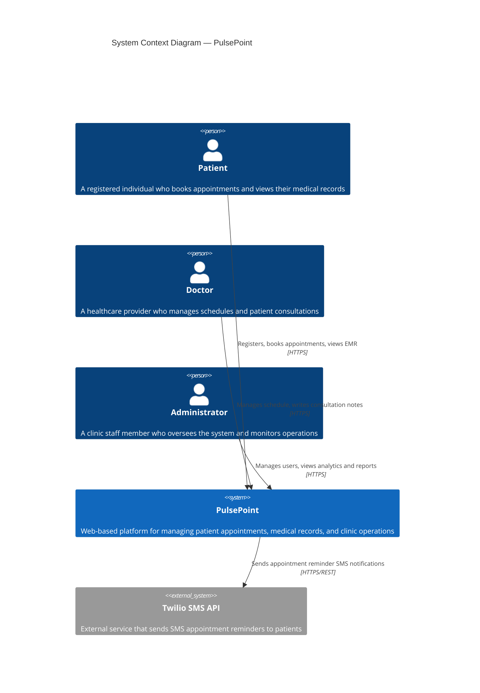
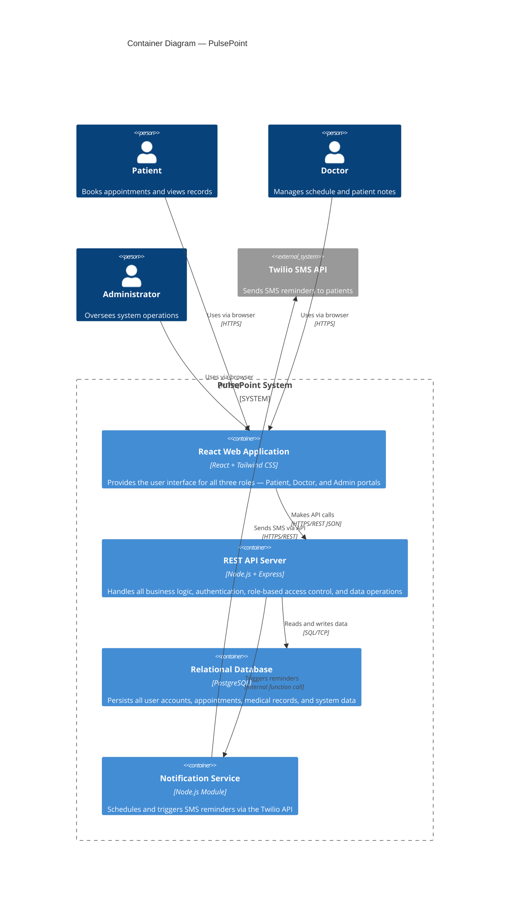
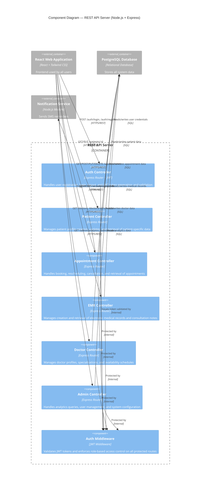
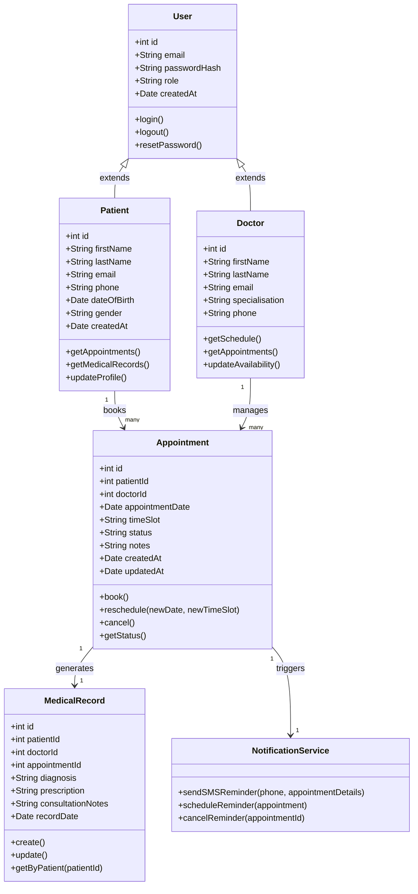

# ARCHITECTURE.md — PulsePoint Patient Appointment & Records System

---

## 1. Introduction

### 1.1 Project Title
**PulsePoint — Patient Appointment & Records System**

---

### 1.2 Domain

**Domain: Healthcare**

The healthcare domain encompasses all systems, services, and processes involved in delivering medical care to individuals. This includes hospitals, private clinics, GP practices, and any institution responsible for maintaining patient health and wellbeing.

PulsePoint operates within the **outpatient clinic and private practice** segment — focusing on appointment management, electronic medical records (EMR), and the communication layer between patients and healthcare providers. Systems in this domain demand high security, data privacy, and reliable availability since they handle sensitive personal and medical information.

---

### 1.3 Problem Statement

Small-to-medium healthcare facilities still rely on manual or paper-based systems to manage patient appointments and medical records. This results in double bookings, lost records, missed appointments due to no reminders, and no operational visibility for administrators. PulsePoint solves these problems by providing a single unified web platform that digitises and automates the end-to-end patient journey ,  from registration and appointment booking through to consultation records and SMS notifications.

---

### 1.4 Individual Scope & Feasibility Justification

PulsePoint is scoped as an individual semester-long project. It is built on React and Node.js ,  well-documented, widely supported technologies and is divided into three clearly bounded user roles (Patient, Doctor, Administrator). SMS notifications are handled by the Twilio API, avoiding the need to build complex communication infrastructure from scratch. The system is entirely web-based with no hardware dependencies and can be developed incrementally, making it fully feasible for a single developer within the semester timeframe.

---

## 2. C4 Architectural Diagrams

The C4 model describes software architecture at four levels of abstraction:
- **Level 1 — System Context**: The system and its relationship to users and external services
- **Level 2 — Container**: The high-level technology building blocks inside the system
- **Level 3 — Component**: The internal components within each container
- **Level 4 — Code**: The key classes and data structures within a component

---

## 2.1 Level 1 — System Context Diagram

> Shows PulsePoint as a whole and how it interacts with users and external systems.

---

## 2.2 Level 2 — Container Diagram

> Shows the high-level technology building blocks (containers) that make up PulsePoint.

---

## 2.3 Level 3 — Component Diagram

> Shows the internal components within the REST API Server container.

---

## 2.4 Level 4 — Code Diagram

> Shows the key classes and relationships within the Appointment Controller component.

---

## 3. Summary of Architecture Decisions

| Decision | Choice | Reason |
|---|---|---|
| **Frontend Framework** | React + Tailwind CSS | Component-based architecture makes role-specific portals easy to manage |
| **Backend Framework** | Node.js + Express | Lightweight, fast, and well-suited for REST API development |
| **Database** | PostgreSQL | Relational data model suits structured healthcare records with clear relationships |
| **Authentication** | JWT + RBAC | Stateless authentication scales well; role-based control protects sensitive data |
| **SMS Notifications** | Twilio API | Reliable, well-documented third-party service — no need to build SMS infrastructure |
| **Architecture Style** | Monolithic (modular) | Appropriate for a single-developer semester project; can be split into microservices later |