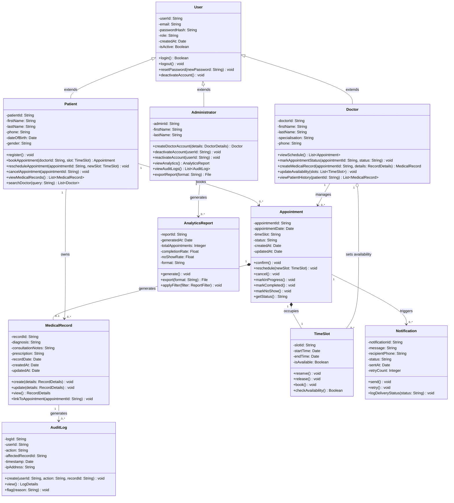

# CLASS-DIAGRAM.md — PulsePoint System Class Diagram

**Project:** PulsePoint — Patient Appointment & Records System
**Assignment:** 9 — Domain Modeling and Class Diagram Development

---

## 1. Introduction

This document presents the full UML class diagram for the PulsePoint system using Mermaid.js. The diagram models all core classes, their attributes and methods, and the relationships between them including associations, compositions, aggregations, and inheritance. The diagram is aligned with the functional requirements from Assignment 4, the use cases from Assignment 5, and the state and activity diagrams from Assignment 8.

---

## 2. Class Diagram

---

## 3. Key Design Decisions

### 3.1 Inheritance — User as Base Class
The `User` class serves as the base class for `Patient`, `Doctor`, and `Administrator`. All three share common attributes such as `userId`, `email`, `passwordHash`, `role`, and `isActive`, as well as common methods like `login()`, `logout()`, and `resetPassword()`. Using inheritance here avoids duplication and centralises authentication logic in one place — aligning with the role-based access control requirement from Assignment 4.

### 3.2 Composition — Appointment owns MedicalRecord and TimeSlot
A `MedicalRecord` cannot exist without an `Appointment` — it is always created in the context of a consultation. Similarly, a `TimeSlot` is always occupied by an `Appointment` once booked. These are modelled as **composition** relationships, meaning the child objects do not exist independently of the parent `Appointment`.

### 3.3 Aggregation — Doctor sets TimeSlot availability
A `Doctor` sets up `TimeSlot` objects to define their availability, but `TimeSlots` can exist independently of a specific doctor — they are not destroyed if the doctor's account is deactivated. This is modelled as **aggregation** rather than composition.

### 3.4 Notification as a Separate Class
The `Notification` class is kept separate from `Appointment` to encapsulate all SMS-related logic including retry handling and delivery status logging. This aligns with the modular architecture requirement from Assignment 4 and reflects the Twilio integration described in the system specification.

### 3.5 AuditLog as an Independent Class
The `AuditLog` class is independent and immutable — logs can be created and viewed but never modified or deleted. This design decision directly addresses the medical regulator stakeholder's requirement for a tamper-proof audit trail.

### 3.6 AnalyticsReport as a Separate Class
Separating `AnalyticsReport` from the `Administrator` class keeps the analytics logic encapsulated and makes it easier to extend in the future — for example, adding scheduled reports or new metrics — without modifying the Administrator class.

---

## 4. Relationship Summary

| Relationship | Type | Multiplicity | Description |
|---|---|---|---|
| User → Patient, Doctor, Admin | Inheritance | — | Patient, Doctor, and Admin extend the base User class |
| Patient → Appointment | Association | 1 to 0..* | A patient can have many appointments |
| Doctor → Appointment | Association | 1 to 0..* | A doctor manages many appointments |
| Appointment → MedicalRecord | Composition | 1 to 0..1 | An appointment generates at most one medical record |
| Appointment → TimeSlot | Composition | 1 to 1 | An appointment always occupies exactly one time slot |
| Doctor → TimeSlot | Aggregation | 1 to 0..* | A doctor sets up many available time slots |
| Appointment → Notification | Association | 1 to 0..* | An appointment can trigger multiple notifications |
| MedicalRecord → AuditLog | Association | 1 to 0..* | Every record access or modification generates an audit log |
| Administrator → AnalyticsReport | Association | 1 to 0..* | An administrator can generate many reports |
| Patient → MedicalRecord | Association | 1 to 0..* | A patient owns many medical records over time |