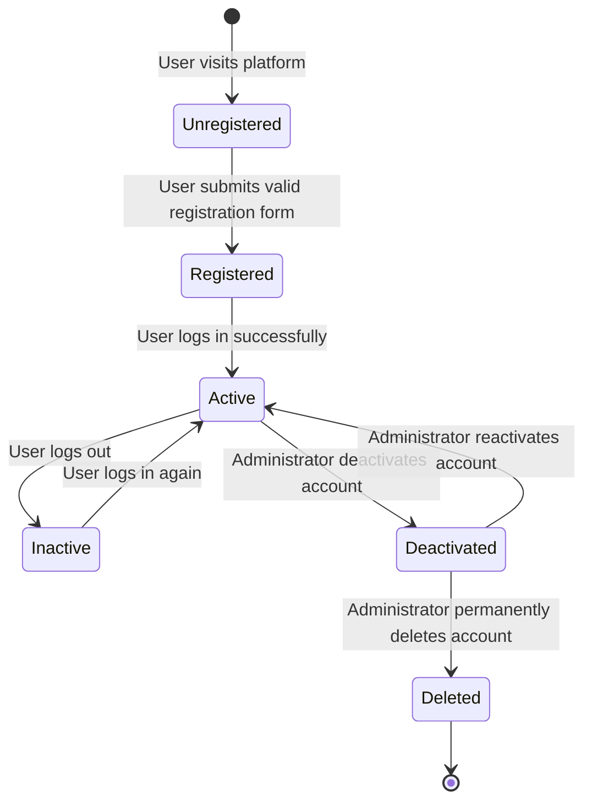
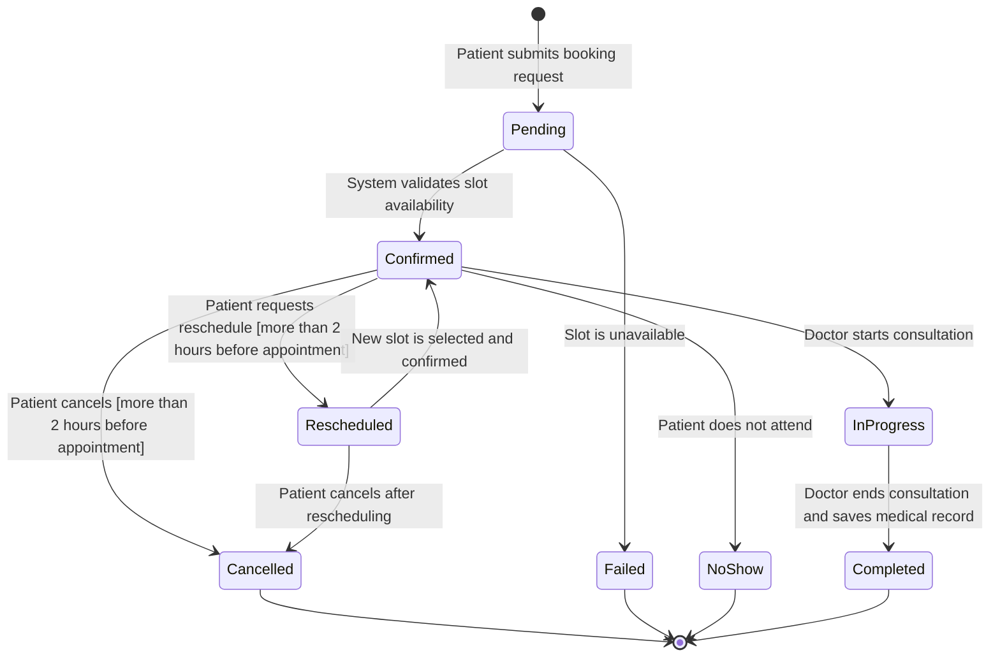
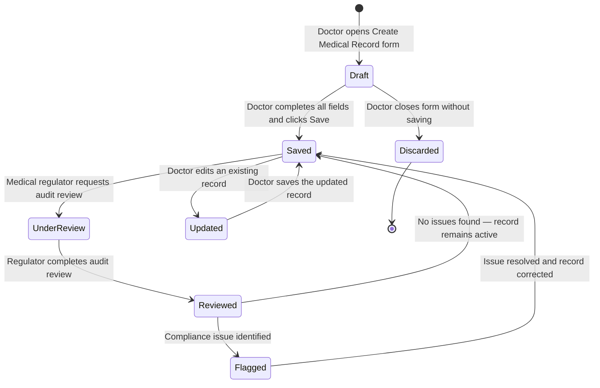
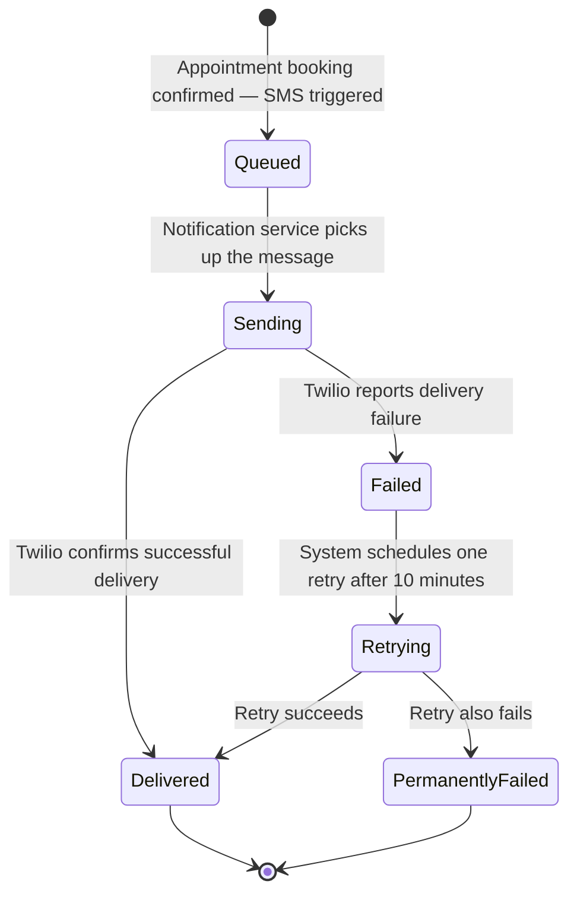
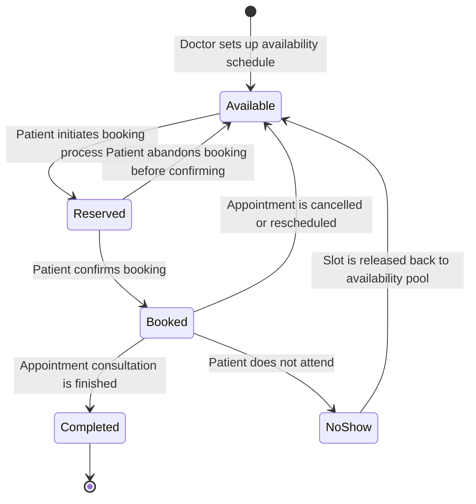
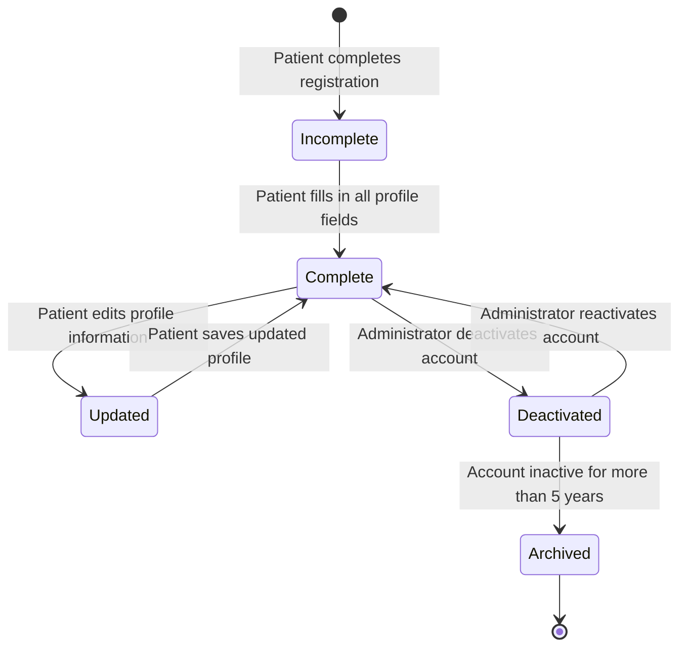
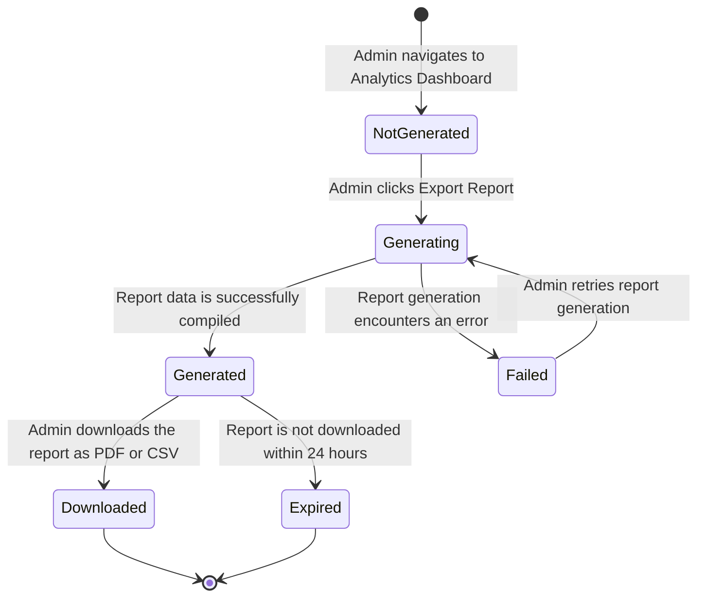
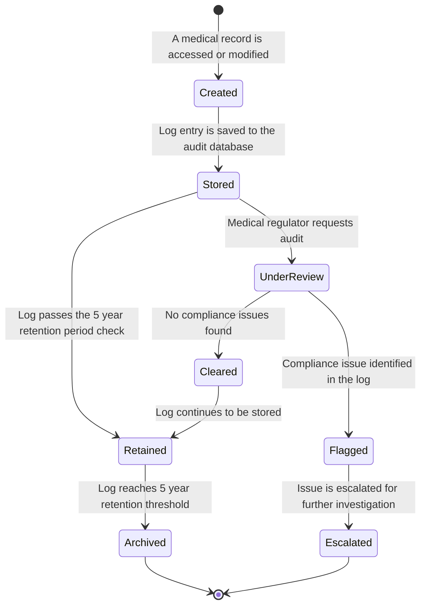

# STATE-DIAGRAMS.md — Object State Modeling for PulsePoint

**Assignment:** 8 — Object State Modeling and Activity Workflow Modeling

---

## 1. Introduction

This document presents state transition diagrams for 8 critical objects in the PulsePoint system. Each diagram models the lifecycle of an object , showing all possible states it can be in, the events that trigger transitions between states, and any guard conditions that must be satisfied for a transition to occur. All diagrams are aligned with the functional requirements defined in Assignment 4 and the user stories defined in Assignment 6.

---

## 2. State Transition Diagram 1 — User Account

### Diagram

### Explanation

| State | Description |
|---|---|
| **Unregistered** | The user has not yet created an account on PulsePoint |
| **Registered** | The user has successfully submitted the registration form and an account exists in the database |
| **Active** | The user is currently logged in with a valid JWT session token |
| **Inactive** | The user has logged out and the JWT token has expired or been cleared |
| **Deactivated** | The administrator has deactivated the account — the user cannot log in |
| **Deleted** | The account has been permanently removed from the system |

**Functional Requirement Mapping:** This diagram maps to Functional Requirement 01 (User Registration) and Functional Requirement 09 (Administrator User Management). The Deactivated state directly addresses the requirement that deactivated accounts cannot log in but their data is retained.

**User Story Mapping:** US001 (Patient registers an account), US002 (Patient logs in), US011 (Admin manages user accounts).

---

## 3. State Transition Diagram 2 — Appointment

### Diagram

### Explanation

| State | Description |
|---|---|
| **Pending** | The booking request has been submitted but not yet confirmed |
| **Confirmed** | The slot is available and the appointment is confirmed — SMS sent to patient |
| **Failed** | The requested slot was unavailable at the time of confirmation |
| **Rescheduled** | The patient has requested a new time for an existing confirmed appointment |
| **InProgress** | The consultation is currently taking place |
| **Completed** | The consultation is finished and a medical record has been saved |
| **Cancelled** | The appointment was cancelled by the patient or receptionist |
| **NoShow** | The patient did not attend the appointment |

**Functional Requirement Mapping:** This diagram maps to Functional Requirement 03 (Appointment Booking), Functional Requirement 04 (Rescheduling and Cancellation), and Functional Requirement 05 (Doctor Schedule Management). The guard condition "more than 2 hours before appointment" maps directly to the cancellation and rescheduling restrictions in the requirements.

**User Story Mapping:** US004 (Book appointment), US005 (Reschedule appointment), US006 (Cancel appointment).

---

## 4. State Transition Diagram 3 — Medical Record

### Diagram

### Explanation

| State | Description |
|---|---|
| **Draft** | The medical record form has been opened but not yet saved |
| **Saved** | The record has been saved and linked to the patient and appointment |
| **Discarded** | The doctor closed the form without saving — no record created |
| **Updated** | A previously saved record is being edited by the doctor |
| **UnderReview** | The record is being audited by a medical regulator |
| **Reviewed** | The audit is complete with no compliance issues |
| **Flagged** | A compliance issue was identified during the audit |

**Functional Requirement Mapping:** This diagram maps to Functional Requirement 06 (EMR Creation), Functional Requirement 07 (Patient Medical Records Access), and Functional Requirement 12 (Audit Trail Logging). The Flagged state addresses the medical regulator's concern about compliance violations.

**User Story Mapping:** US010 (Doctor creates medical record), US008 (Patient views medical records), US014 (Regulator views audit logs).

---

## 5. State Transition Diagram 4 — SMS Notification

### Diagram

### Explanation

| State | Description |
|---|---|
| **Queued** | The SMS has been triggered and is waiting to be picked up by the notification service |
| **Sending** | The notification service has sent the request to the Twilio API |
| **Delivered** | Twilio has confirmed the SMS was successfully delivered to the patient |
| **Failed** | Twilio reported that the SMS delivery failed |
| **Retrying** | The system is waiting 10 minutes before attempting a second delivery |
| **PermanentlyFailed** | Both the initial send and the retry failed — the failure is logged |

**Functional Requirement Mapping:** This diagram maps to Functional Requirement 08 (SMS Appointment Reminders). The retry logic directly addresses the requirement that failed SMS deliveries must be retried once after 10 minutes.

**User Story Mapping:** US007 (Patient receives SMS reminder).

---

## 6. State Transition Diagram 5 — Doctor Availability Slot

### Diagram

### Explanation

| State | Description |
|---|---|
| **Available** | The slot is open and can be booked by a patient |
| **Reserved** | The slot is temporarily held while a patient is in the process of booking |
| **Booked** | The slot has been confirmed and linked to a specific appointment |
| **Completed** | The appointment for this slot has been successfully completed |
| **NoShow** | The patient did not attend — slot is released back to available |

**Functional Requirement Mapping:** This diagram maps to Functional Requirement 03 (Appointment Booking) and Functional Requirement 05 (Doctor Schedule Management). The Reserved state prevents double bookings during the brief window between slot selection and booking confirmation.

**User Story Mapping:** US003 (Search for doctor), US004 (Book appointment), US009 (Doctor views schedule).

---

## 7. State Transition Diagram 6 — Patient Profile

### Diagram

### Explanation

| State | Description |
|---|---|
| **Incomplete** | The patient has registered but has not completed all profile fields |
| **Complete** | All required profile fields are filled in and the profile is fully active |
| **Updated** | The patient is currently editing their profile information |
| **Deactivated** | The administrator has deactivated the patient's account |
| **Archived** | The account has been inactive for more than 5 years and is archived for compliance |

**Functional Requirement Mapping:** This diagram maps to Functional Requirement 01 (User Registration) and Functional Requirement 09 (Administrator User Management). The Archived state addresses the medical regulator's requirement for 5-year data retention.

**User Story Mapping:** US001 (Patient registers an account), US011 (Admin manages user accounts).

---

## 8. State Transition Diagram 7 — Admin Report

### Diagram

### Explanation

| State | Description |
|---|---|
| **NotGenerated** | No report has been requested yet — admin is viewing live dashboard data |
| **Generating** | The system is querying the database and compiling the report data |
| **Generated** | The report has been successfully compiled and is ready for download |
| **Failed** | An error occurred during report generation |
| **Downloaded** | The admin has successfully downloaded the report |
| **Expired** | The generated report was not downloaded within 24 hours and has been cleared |

**Functional Requirement Mapping:** This diagram maps to Functional Requirement 10 (Administrator Analytics Dashboard). The Failed and retry states address the alternative flow where report export fails.

**User Story Mapping:** US012 (Admin views analytics dashboard).

---

## 9. State Transition Diagram 8 — Audit Log Entry

### Diagram

### Explanation

| State | Description |
|---|---|
| **Created** | A new audit log entry has been triggered by a record access or modification |
| **Stored** | The log entry has been saved to the audit database |
| **UnderReview** | The log is being reviewed by a medical regulator |
| **Retained** | The log is being actively retained in compliance with the 5-year retention policy |
| **Cleared** | The review found no compliance issues |
| **Flagged** | A compliance issue was identified in the log entry |
| **Escalated** | The flagged issue has been escalated for further investigation |
| **Archived** | The log has reached the end of its 5-year retention period and is archived |

**Functional Requirement Mapping:** This diagram maps to Functional Requirement 12 (Audit Trail Logging). The Retained and Archived states directly address the requirement that logs must be retained for a minimum of 5 years in compliance with healthcare regulations.

**User Story Mapping:** US014 (Regulator views audit logs).