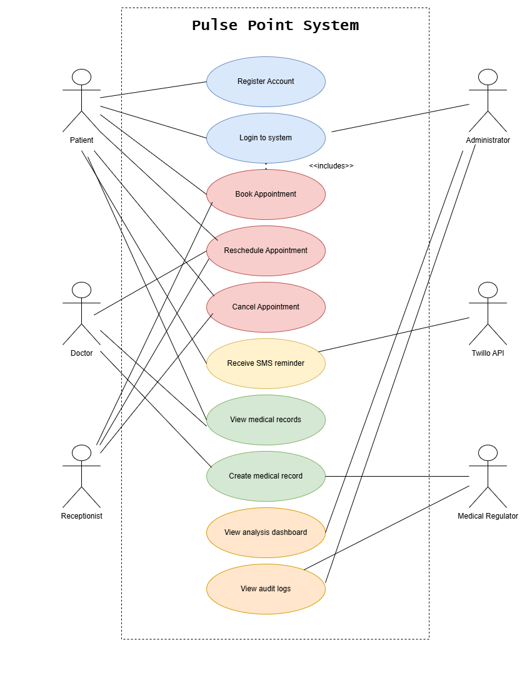

# USECASES.md — PulsePoint Patient Appointment & Records System

---

## 1. Introduction

This document presents the use case diagram for the PulsePoint system, modelled using UML standards. The diagram identifies all actors who interact with the system and the use cases they can perform. All use cases are directly aligned with the functional requirements defined in Assignment 4 and the stakeholder concerns identified in Assignment 4.

---

## 2. Use Case Diagram

---

## 3. Actors and Their Roles

### 3.1 Patient
The Patient is the primary end user of PulsePoint. They interact with the system to register an account, log in, search for doctors, book appointments, reschedule or cancel appointments, and view their personal medical records. The Patient actor directly addresses the stakeholder concern of providing a self-service portal that reduces reliance on phone-based booking.

### 3.2 Doctor
The Doctor is a healthcare provider who uses PulsePoint to manage their daily appointment schedule, create electronic medical records after consultations, and view patient medical histories. The Doctor actor addresses the stakeholder concern of eliminating paper-based scheduling and fragmented record keeping.

### 3.3 Administrator
The Administrator oversees the entire system. They manage doctor and patient accounts, monitor the analytics dashboard for operational insights, and access audit logs for compliance purposes. The Administrator actor addresses the stakeholder concern of having real-time visibility into clinic operations.

### 3.4 Receptionist
The Receptionist assists patients who are unable to use the system independently. They can log in and perform appointment booking, rescheduling, and cancellation on behalf of patients. The Receptionist actor addresses the stakeholder concern of supporting both self-service and staff-assisted workflows simultaneously.

### 3.5 Medical Regulator
The Medical Regulator is an external compliance stakeholder who requires access to audit logs to verify that patient data is being handled in accordance with healthcare regulations such as POPIA. This actor addresses the stakeholder concern of maintaining a complete and tamper-proof audit trail.

### 3.6 Twilio SMS API
Twilio is an external system actor that is triggered by PulsePoint to send automated SMS appointment reminders to patients. Twilio does not initiate any use cases itself — it is invoked as part of the Receive SMS Reminder use case. This actor addresses the stakeholder concern of reducing appointment no-shows through automated notifications.

---

## 4. Relationships Between Actors and Use Cases

### 4.1 Include Relationships
Include relationships indicate that one use case always requires another use case to function correctly.

- **Book Appointment includes Login to System** — A patient must be authenticated before they can book an appointment.
- **Reschedule Appointment includes Login to System** — Authentication is required before rescheduling.
- **Cancel Appointment includes Login to System** — Authentication is required before cancellation.
- **View Medical Records includes Login to System** — Records are only accessible to authenticated users.
- **Create Medical Record includes Login to System** — Doctors must be logged in to create records.
- **Manage Schedule includes Login to System** — Doctors must be authenticated to view and manage their schedule.
- **Manage User Accounts includes Login to System** — Admin actions require authentication.
- **View Analytics Dashboard includes Login to System** — Analytics are only accessible to authenticated administrators.
- **Book Appointment includes Search for Doctor** — A patient must search for and select a doctor before completing a booking.
- **Receive SMS Reminder includes Book Appointment** — An SMS reminder is only triggered after a successful booking.

### 4.2 Generalisation Relationships
Both the **Patient** and the **Receptionist** can perform appointment-related use cases (Book, Reschedule, Cancel). The Receptionist performs these on behalf of patients who need assistance, meaning both actors share the same appointment management use cases but represent different interaction contexts.

---

## 5. How the Diagram Addresses Stakeholder Concerns

| Stakeholder | Concern from Assignment 4 | Use Case That Addresses It |
|---|---|---|
| Patient | Convenient self-service booking without phoning the clinic | Book Appointment, Search for Doctor |
| Patient | Access to personal medical history at any time | View Medical Records |
| Patient | Timely reminders to avoid missing appointments | Receive SMS Reminder |
| Doctor | Organised schedule to avoid double bookings | Manage Schedule |
| Doctor | Quick access to patient history before consultations | View Medical Records |
| Doctor | Efficient tools for writing consultation notes | Create Medical Record |
| Administrator | Real-time visibility into clinic operations | View Analytics Dashboard |
| Administrator | Ability to manage user accounts efficiently | Manage User Accounts |
| Receptionist | Fast booking interface for assisting patients | Book Appointment, Reschedule Appointment |
| Medical Regulator | Audit trail of all record access and modifications | View Audit Logs |
| Twilio | Reliable and correctly triggered SMS notifications | Receive SMS Reminder |